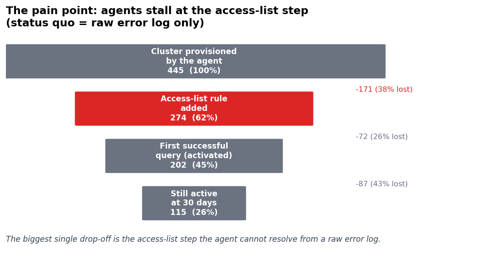
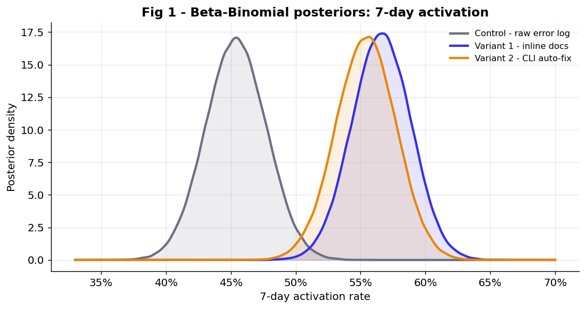
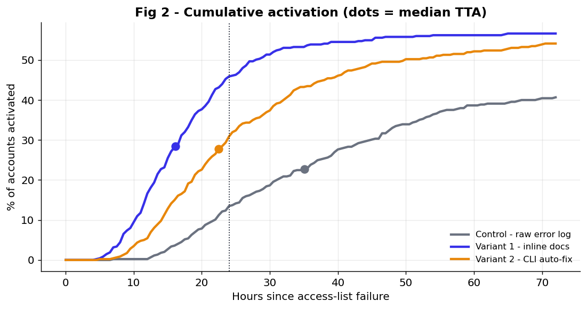
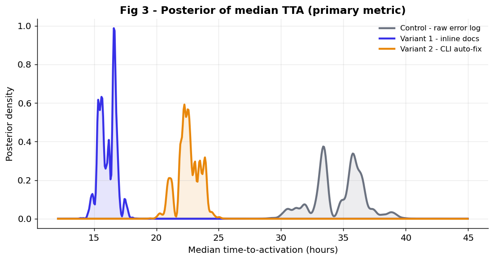
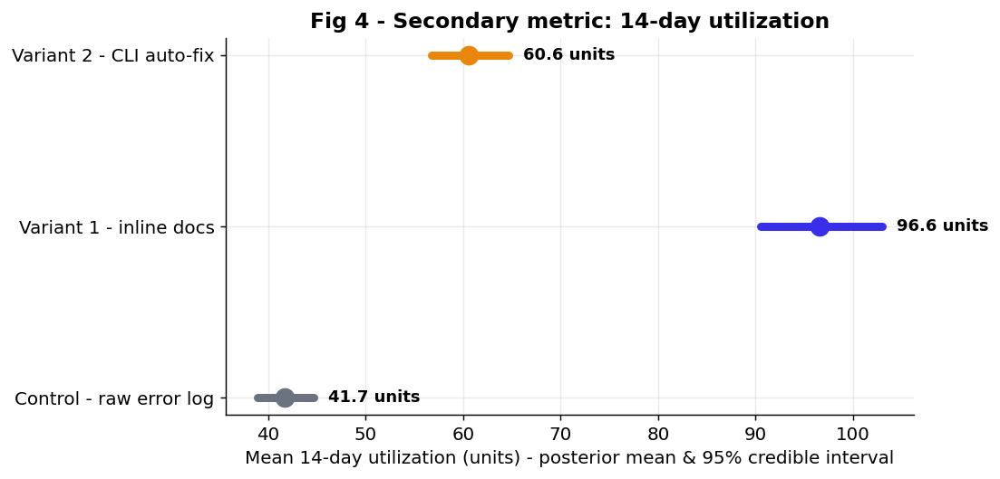
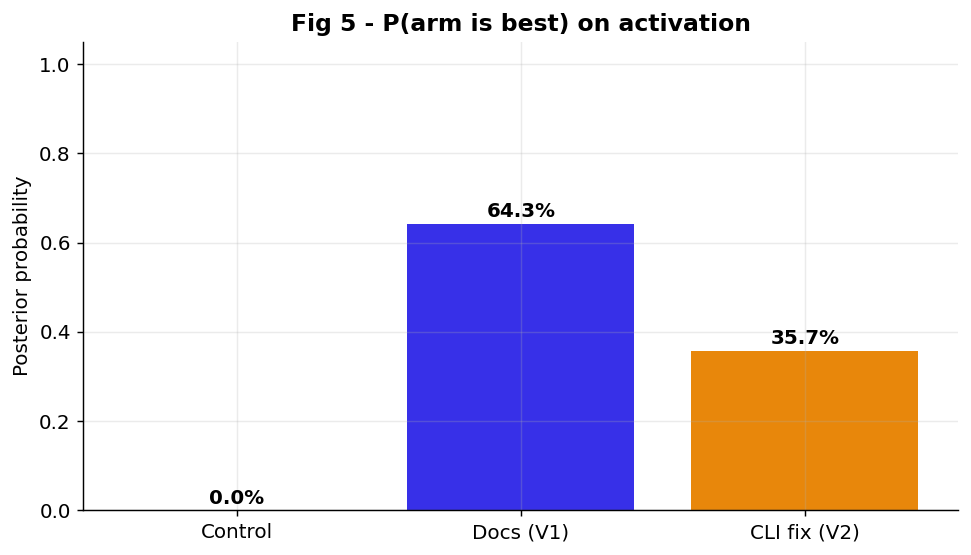
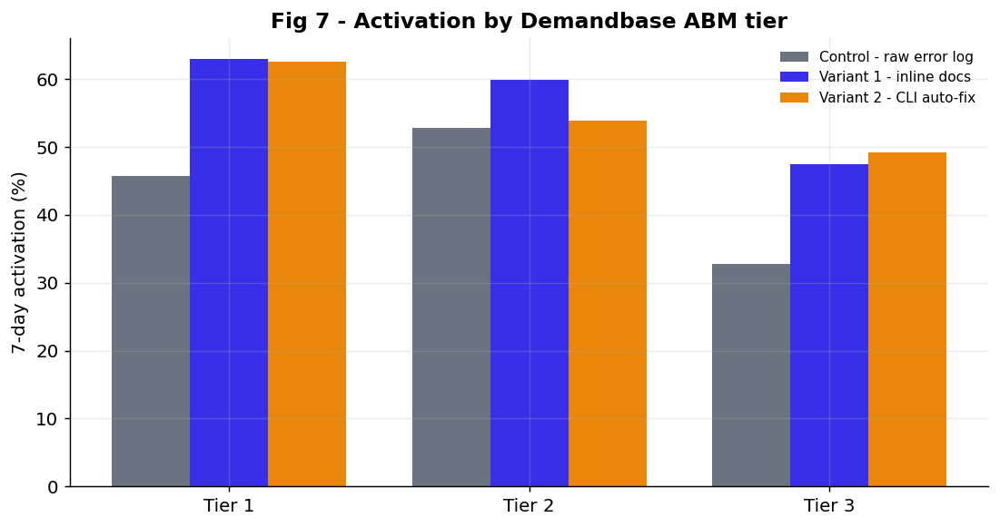
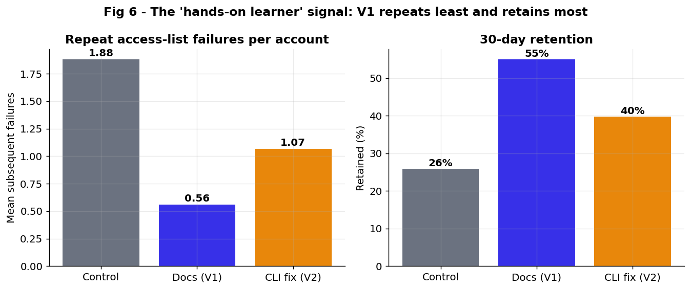

{}
This page is a **teaching artifact** for the experimentation curriculum. It walks the full
lifecycle of a single test — **design doc → simulated run → readout** — on a fully synthetic
dataset (product telemetry + Demandbase firmographics). Every figure is computed from the
attached CSV (`data/alg_whitelist_experiment_data.csv`); the analysis is reproducible from the
attached scripts (`scripts/generate_data.py`, `scripts/analysis.py`). Product names ("Adam",
"LycheeServer") are fictional stand-ins.
{}

| | |
|---|---|
| **Experiment ID** | EXP-2025-114 |
| **Owner** | Growth / Lifecycle Experimentation |
| **Window** | Apr 7 – May 18, 2025 (6-week horizon, weekly checkpoints) |
| **Surface** | Agentic build flow (ALG) |
| **Status** | **DECISIVE — SHIP VARIANT 1** |

## TL;DR for stakeholders

**Inline developer documentation (Variant 1)** won on the primary metric, the secondary
metric, and both guardrails — it is the recommended ship. Counter to the intuition that an
auto-fix would be fastest, **showing the implementation steps beat doing the fix for the
agent.** The CLI auto-fix stalls at a security-approval boundary, and developers who add the
access-list rule themselves *learn it* and stop hitting the wall.

| Headline result | Effect | Detail |
|---|---|---|
| **Median time-to-activation** (primary) | **−53%** | 34.6h → 16.1h · P(faster than control) = 100% |
| **7-day activation rate** (supporting) | **+11.2pp** | 45.4% → 56.6% · P(beats control) ≈ 100% |
| **14-day utilization** (secondary) | **+132%** | 41.7 → 96.6 units · healthy adoption, not a hollow win |
| **Repeat failures / retention** (guardrails) | **best of all arms** | 1.88 → 0.56 repeat failures · 26% → 55% retained at 30d |

---

# Part 1 · Pre-test design doc (the one-pager)

## 1.1 The pain point

**Adam** (our managed NoSQL data platform) ships a *unified Query API key* that coding agents
pull and embed directly into the workflows they build. The agent provisions a cluster
programmatically, wires the key into the app, and runs its first query. There is one step in
that chain the agent reliably forgets: adding the caller's network address to the cluster's
**access list**.

> **In plain terms:** the access list is the cluster's guest list — the set of computers
> allowed to connect. The cluster is healthy and the key is valid, but if the caller isn't on
> the guest list, every connection is turned away. Today, all the agent gets back is a raw
> error log:

```text
CONTROL — current behavior
agent ▸ connecting to cluster "orders-prod" …
LycheeServerError: connection <monitor> to 10.4.211.6:5701 closed
  reason: connection refused — IP not in cluster access list
  code: 6  (HostUnreachable)
✖ build step failed — could not establish client connection
```

The agent has no idea this is a five-minute access-list fix, so it retries, invents
connection-string changes, or abandons the build. Instrumentation on the agentic surface
shows this single failure mode sits in front of a large share of stalled activations.



## 1.2 Hypothesis & the ALG bet

This is an **Agentic-Led Growth (ALG)** problem, not a classic product-led one. The actor at
the keyboard is an agent, so the activation experience has to be legible *to a model mid-build*,
not to a human reading a dashboard. The lever is the content we return at the moment of failure.

> **Hypothesis.**
> **IF** we replace the bare error log with **actionable, agent-readable remediation at the
> point of access** — the moment the access-list failure is detected —
> **THEN** we will see a lower time-to-activation, a higher activation rate, and deeper
> downstream utilization, **without** inflating cost or repeat failures.

We test two philosophies of "actionable": **show the fix** (inline docs) versus **do the fix**
(a CLI auto-remediation command).

## 1.3 Experiment design

A three-arm, randomized, controlled experiment. One control preserves the status quo; two
treatments swap in different remediation payloads the moment the access-list failure is detected.

| Arm | What the agent receives on failure | Philosophy |
|---|---|---|
| **A · Control** | The existing raw error log (above) | Status quo |
| **B · Inline docs (V1)** ⭐ | Structured implementation steps + doc / SDK references, inline in the agent's context | **Show the fix** |
| **C · CLI auto-fix (V2)** | A ready-to-run remediation command the agent can execute | **Do the fix** |

```text
VARIANT 1 — inline docs (show the fix)
⚠ Access-list rule missing for cluster "orders-prod".
To connect, add the caller's egress IP to the cluster access list:
  1. Resolve the egress IP the cluster will see (NAT/egress), not the local IP.
  2. Add it as an access-list entry — use a /32 CIDR for a single host.
  3. Re-run the connection; propagation takes ~30–60s.
docs: /adam/security/ip-access-list   sdk: db.accessList.add(cidr)
```

```text
VARIANT 2 — CLI auto-fix (do the fix)
⚠ Access-list rule missing. Suggested remediation (requires approval):
  $ adam accessList create --currentIp --clusterName orders-prod
  ▸ This modifies network security settings for the cluster.
  ▸ Approve change? [y/N] _
```

## 1.4 Metrics & guardrails

| Role | Metric | Definition | Direction |
|---|---|---|---|
| **Primary** | Time to activation (TTA) | Hours from access-list failure → first successful query, within a 7-day window | Lower is better |
| Supporting | 7-day activation rate | Share of accounts that reach a first successful query within 7 days | Higher is better |
| **Secondary** | 14-day utilization | Compute + storage units consumed in the 14 days after assignment (counts everyone assigned) | Higher is better |
| Guardrail | Repeat access-list failures | Later access-list failures per account — did the fix *stick*? | Lower is better |
| Guardrail | 30-day retention | Account still active at day 30 | Higher is better |

The secondary metric is deliberately a *value* metric, not a speed metric. A remediation that
rushes accounts past the wall but leaves them with a shallow, misconfigured setup would be a
hollow win — utilization guards against that.

## 1.5 Method of evaluation — and why Bayesian

We evaluate with a **Bayesian** framework. The output is not a single yes/no verdict; it is a
*probability distribution* for each arm's true result, which we read as plain-English
probability statements.

> **In plain terms:** a frequentist test answers *"is the difference statistically
> significant?"* A Bayesian analysis answers the questions a decision-maker actually asks:
> *"What's the chance Variant 1 is genuinely better?"* and *"If we ship it and we're wrong,
> how much do we stand to lose?"*

Why that fits this test specifically:

- **Decisions, not verdicts.** Stakeholders act on *"100% chance V1 activates faster, and
  effectively zero downside if we ship it now"* far more readily than on a p-value.
- **Honest weekly peeking.** ALG volume is modest and arrives weekly. Bayesian decision rules
  let us check at each weekly checkpoint and stop when the evidence is sufficient, without the
  false-positive inflation that repeated frequentist tests would cause.
- **Native multi-arm comparison.** With three arms we read *P(arm is best)* and head-to-head
  win-probabilities directly — no multiple-comparison corrections to bolt on.
- **Uncertainty you can size.** Smaller B2B samples mean wider ranges; the posterior shows the
  full credible range instead of collapsing everything to "significant / not significant."

**The models (kept simple):** the activation rate is a yes/no outcome, so we use a
**Beta-Binomial** model (the standard, exact model for a proportion). Time-to-activation and
utilization are continuous and skewed, so we use a **Bayesian bootstrap** — resample the
observed data many times to trace out the range of plausible averages without assuming a tidy
bell curve.

**Decision rule, fixed in advance.** Ship the leading arm on the **primary metric (TTA)** when
its **expected loss is below a 1-hour region of practical equivalence (ROPE)** — i.e., we are
confident the arm we pick is, at worst, a negligible fraction of an hour slower than the true
best arm — evaluated weekly and capped at the 6-week horizon, provided **no guardrail regresses.**

> **Expected loss** = the posterior-average amount by which the arm we choose could trail the
> true best arm. A near-zero expected loss means "even accounting for our uncertainty, picking
> this arm costs us almost nothing."

## 1.6 Population & randomization

- **Eligible unit:** an account-cluster on the agentic build path that triggers the access-list
  failure event. New clusters only; human-console traffic is excluded.
- **Randomization:** at the **account** level (not per-event), so one developer/agent never sees
  two different remediation experiences. Equal 1:1:1 allocation.
- **Enrichment:** each account is joined to **Demandbase** firmographics — industry, employee
  band, revenue band, ABM tier, region, and intent score — so we can cut results by segment
  (e.g., ABM tier) that were defined before launch, without re-randomizing.

## 1.7 Sample size & runtime

Although the readout is Bayesian, we size the test with the standard two-proportion power
calculation as a planning floor (activation rate is the easiest metric to power on). Baseline
activation ≈ 44%, minimum detectable effect +10pp, α = 0.05 (two-sided), power = 0.80.

> **Per-arm sample size, two-proportion test**
>
> n = ( z₁₋α/₂ + z₁₋β )² · [ p₁(1−p₁) + p₂(1−p₂) ] ⁄ (p₂ − p₁)²

| ~392 | ~450 | ~230 / wk | ≈ 6 wks |
|---|---|---|---|
| Required per arm at +10pp MDE | Per-arm target with buffer for attrition & 3-arm comparison | Eligible accounts entering the failure event | Planned runtime (≈1,350 ÷ 230) |

Enrolled at readout: **1,380 accounts** (445 control · 475 V1 · 460 V2). The realized effect on
activation (+11.2pp) is at the MDE, and the effect on the *primary* metric (TTA) is far larger,
so the primary comparison is comfortably powered.

---

# Part 2 · Simulated run & analysis

## 2.1 The dataset

`data/alg_whitelist_experiment_data.csv` holds one row per eligible account-cluster (**1,380
rows, 20 columns**): the assignment, Demandbase firmographics, build context, and the realized
outcomes. A full data dictionary is in the [appendix](#a1-data-dictionary). Descriptive cuts by
arm:

| Arm | n | Activation (7d) | Median TTA | Util (14d) | Repeat fails | Retention (30d) |
|---|--:|--:|--:|--:|--:|--:|
| Control | 445 | 45.4% | 34.6h | 41.7 | 1.88 | 25.8% |
| **Inline docs (V1)** ⭐ | 475 | **56.6%** | **16.1h** | **96.6** | **0.56** | **54.9%** |
| CLI auto-fix (V2) | 460 | 55.4% | 22.6h | 60.6 | 1.07 | 39.8% |

*Descriptive means by arm. Posterior inference and credible intervals follow below.*

## 2.2 Activation rate (supporting)

Both treatments push the activation posterior decisively right of control. **V1 reaches 56.6%**
(95% credible interval 52.1–61.0%) versus **45.4%** for control (40.8–50.0%) — an absolute lift
of **+11.2pp** (CI +4.8 to +17.6), with **P(V1 beats control) ≈ 100%**. V2 lands at 55.4%
(+10.0pp). Notably, the two *treatments* are nearly tied here — the probability V1 beats V2 on
activation rate alone is only **64.3%**. Hold that thought; it matters for the decision.



## 2.3 Time to activation · *primary*

On the metric that decides the test, **V1 more than halves the median time to activation**: from
34.6h (control) to **16.1h** — a reduction of **18.6h (−53%)** (CI 14.2–22.6h) with
**P(faster than control) = 100%**. The cumulative-activation curve shows V1 both rising fastest
*and* reaching the highest ceiling.



The surprise is the ordering of the two treatments. The CLI auto-fix (V2) lands at 22.6h —
faster than control, but **100% likely to be slower than simply showing the steps.** The
posterior of the median makes the separation unambiguous:



## 2.4 Secondary: 14-day utilization

The activation win is not hollow. V1's mean 14-day utilization is **96.6 units** (CI 90.5–103.0)
versus 41.7 for control — **+132%**, P > 99.9%. V2 improves utilization too (+45%) but only about
a third as much as V1. **Accounts that learn the setup themselves go on to use the platform more.**



## 2.5 Decision summary

Here is where the Bayesian framing earns its keep. On the **primary metric (TTA)**, V1 is the
best arm with **P(best) = 100%** and an **expected loss of ~0.0 hours** — comfortably inside the
1-hour ROPE. The decision rule is satisfied: **ship V1.**



| Arm | P(best) · TTA | Expected loss · TTA | P(best) · activation | Expected loss · activation |
|---|--:|--:|--:|--:|
| Control | 0% | 18.6h | ~0% | 11.98pp |
| **Inline docs (V1)** ⭐ | **100%** | **0.0h** | 64.3% | 0.79pp |
| CLI auto-fix (V2) | 0% | 6.5h | 35.7% | 1.97pp |

> **Teaching note.** Look at the two right-hand columns. On the **activation rate** alone, V1 is
> the best arm with only **64.3%** probability — well under a naïve "95% to declare a winner"
> bar — because the two treatments are nearly tied on that metric. If you had picked activation
> rate as your decision metric and demanded P(best) > 95%, you would have called this test
> *inconclusive between the treatments.* But the **primary metric was time-to-activation**,
> where V1 wins with certainty and essentially zero expected loss. This is exactly why we
> **pre-commit to a single primary metric and an expected-loss rule** — it stops a near-tie on a
> secondary signal from muddying a decision the primary metric makes clearly.

## 2.6 Segmentation — does the win hold across the book?

Cutting by Demandbase ABM tier, **V1 leads in every tier**, so the recommendation generalizes
rather than riding one segment. The lift is somewhat larger in Tier 1 / Tier 2 accounts, which
carry higher intent and more capable agent toolchains.



## 2.7 Why V1 wins — the mechanism

Two guardrail signals explain the result and point to the real learning. V1 accounts hit the
access-list wall **far less often afterward** (0.56 repeat failures per account vs. 1.07 for V2
and 1.88 for control) and **retain markedly better at 30 days** (54.9% vs. 39.8% vs. 25.8%).



> **The counter-intuitive bit.** The auto-fix (V2) *should* have been fastest — it does the work
> for the agent. It wasn't, because the remediation touches **network security settings**, so it
> lands behind an approval gate. Many agent frameworks won't auto-approve a security change; they
> pause, loop, or hand back to a human, adding round-trips. The inline docs (V1) fold straight
> into the agent's existing build loop with no trust boundary to cross — and, crucially, the
> agent *keeps* the knowledge.

---

# Part 3 · Experiment readout

## 3.1 Verdict & the headline learning

**Ship Variant 1 (inline developer documentation) to 100% of the agentic build surface.** It wins
the primary metric (−53% median TTA, P = 100%), the secondary metric (+132% utilization), and
both guardrails, with an expected loss on the primary metric inside the pre-registered ROPE.

> **Learning: developers are hands-on learners.**
>
> Given a stuck agent, the instinct is to remove the work. The data says the opposite — the
> highest-leverage move was to **hand the developer (and their agent) the steps and let them
> implement the fix themselves.** Doing so didn't just unblock the moment; it transferred the
> mental model. V1 accounts stopped re-hitting the wall and used the platform more.
> *Self-served competence compounds; a black-box auto-fix patches the symptom and teaches nothing.*

## 3.2 What we ship

1. **Roll out V1** as the default access-list failure response across the agentic surface; retire
   the bare error log.
2. **Generalize the pattern.** Audit the other top agent-facing failures (auth scope, region
   mismatch, connection-string format) and convert each bare error into structured, inline
   implementation steps.
3. **Don't discard V2 — relocate it.** Keep the CLI fix as an *optional, explicitly-offered*
   action *after* the steps, for agents/humans who opt into auto-remediation. The lesson is about
   the default, not about banning auto-fix.
4. **Lifecycle hook.** Feed the "learned it / repeated it" signal into onboarding nurtures —
   accounts with repeat failures get a hands-on setup guide, not a "contact sales" nudge.
   High-intent Tier 1 accounts that activate via V1 are the strongest expansion candidates.

## 3.3 Next experiments & caveats

- **V1.1 — approval-aware auto-fix.** Re-test V2 with the security-approval friction removed
  (pre-scoped, least-privilege token) to isolate how much of V2's gap was the gate vs. the
  missing learning.
- **Dosage.** Does adding the SDK one-liner to the docs payload move TTA further, or is the
  3-step list already sufficient?
- **Durability.** Confirm the retention and utilization gaps hold at 60/90 days before booking
  the full lifetime-value impact.
- **Caveats.** Synthetic data for teaching; effects are modeled, not observed. Utilization counts
  everyone assigned (intent-to-treat) and is right-skewed, so we report posterior means.
  Generalization beyond the agentic path is untested.

---

# Appendix · Reference

## A.1 Data dictionary

| Column | Type | Description |
|---|---|---|
| `account_id` | id | Randomization unit (account) |
| `cluster_id` | id | Cluster that triggered the failure |
| `assignment_date` / `whitelist_failure_ts` | date / ts | Assignment day and exact failure timestamp |
| `variant` | cat | `control` · `docs_v1` · `cli_fix_v2` |
| `account_name` | str | Fictional company name |
| `db_industry · db_employee_band · db_revenue_band · db_region` | cat | Demandbase firmographics |
| `db_account_tier · db_intent_score · is_icp` | cat / int / bool | ABM tier, Demandbase intent (0–100), ICP flag |
| `agent_framework · cluster_tier` | cat | Agent toolchain and cluster size at failure |
| `activated_7d` | bool | First successful query within 7 days |
| `time_to_activation_hrs` | float | Primary metric; null if not activated |
| `repeat_whitelist_failures` | int | Guardrail; later access-list failures |
| `util_14d_units` | float | Secondary metric; normalized compute + storage |
| `retained_30d` | bool | Guardrail; active at day 30 |

## A.2 Methods & sources

- **Activation:** conjugate Beta-Binomial, prior Beta(1,1); 200k posterior draws for P(best),
  head-to-head win-probabilities, and expected loss.
- **TTA & utilization:** Bayesian bootstrap (Rubin, 1981) — Dirichlet(1,…,1) weights, 40k
  replicates — for the posterior of the median (TTA, among activated) and the mean (utilization,
  intent-to-treat).
- **Decision rule:** ship when the leading arm's expected loss on the primary metric (TTA) is
  below a 1-hour ROPE, evaluated weekly, capped at the 6-week horizon, with no guardrail regression.
- **Reproducibility:** `scripts/generate_data.py` builds the dataset (seeded);
  `scripts/analysis.py` produces every figure and `data/analysis_results.json`.
- **Lineage:** sample-size and credible-interval conventions follow Kohavi et al., *Controlled
  Experiments on the Web* (2009); sequential decisioning follows the expected-loss / ROPE practice
  common in modern Bayesian A/B testing.

---

*EXP-2025-114 · Agent Access-List Remediation · Synthetic teaching dataset · Growth Experimentation
curriculum. Generated for internal education. All accounts, firmographics, products, and outcomes
are fabricated.*
